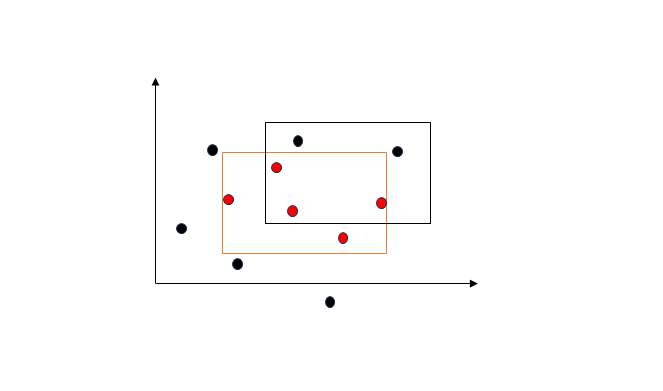
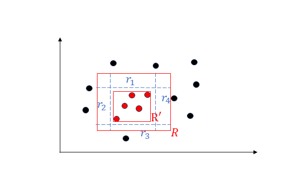

The PAC Learning Framework
===============================

在设计和分析针对样本的学习算法时，需要考虑一下几个基本的问题：
- What can be learned efficiently?
- What is inherently hard to learn?、
- How many examples are needed to learn successfully?
- Is there a general model of learning?

为解决这些问题，我们可以通过**概率近似正确（Probably Approximately Correct）** 学习框架对上述问题形式化并给出答案。PAC框架借助样本复杂度和学习算法的时间空间复杂度来定义可学习的概念类。

框架内容
-------------------------
**概念类**：我们可能想要学习的概念构成的集合，记为$\mathcal{C}$

我们假定所有的经验（样本）是独立同分布的，并且服从的某个固定但未知的分布$\mathcal{D}$。在这样的假定下，机器学习问题可以如下形式化：

学习器的任务是：利用带标签的样本集$S$，从所有可能的概念集合$\mathcal{H}$（假设集）中选择一个假设$h_S\in\mathcal{H}$，使其关于待学习的目标概念$c\in\mathcal{C}$有尽可能小的**泛化误差**

**泛化误差**：*给定一个假设$h\in\mathcal{H}$，一个目标概念$c\in\mathcal{C}$，以及一个潜在分布$\mathcal{D}$，则$h$的泛化误差或风险定义为*

$$R(h)=\underset{x\sim\mathcal{D}}{\mathbb{P}}[h(x)\ne c(x)]=\underset{x\sim\mathcal{D}}{\mathbb{E}}[\mathbf{1}_{h(x)\ne c(x)}]$$

然而我们根据定义可以知道，对于学习器而言，一个假设的泛化误差并不是直接可得到的，由于分布$\mathcal{D}$和目标概念$c$均是未知的。我们可以在有标签的样本集$S$上度量一个假设的**经验误差**

**经验误差**：*给定一个假设$h\in\mathcal{H}$，一个目标概念$c\in\mathcal{C}$，以及一个样本集$S=(x_1,x_2,...x_m)$，则$h$的经验误差定义为*

$$\hat{R}_S(h)=\frac{1}{m}\sum_{i=1}^m\mathbf{1}_{h(x_i)\ne c(x_i)}$$

因此总结一下，$h\in\mathcal{H}$的经验误差是在样本集$S$上的平均误差，而$h\in\mathcal{H}$的泛化误差则是在分布$\mathcal{D}$上的期望误差。不加证明的结论是，在某些一般性的假设下，这两个误差关于近似程度的保证有较高的概率成立。

注意到这样一个事实（只要你学过概率论）:对于一个固定的$h\in\mathcal{H}$，在独立同分布样本集上经验误差的期望等于泛化误差。换句话说，经验误差是泛化误差的无偏估计量。

$$\underset{S\sim\mathcal{D}^m}{\mathbb{E}}[\hat{R}_S(h)]=R(h)$$

**************************************

**PAC学习**：*如果存在一个算法$\mathcal{A}$以及一个多项式函数$poly()$，使得对于任意$\epsilon>0$以及$\delta>0$，如果所有在$X$上的分布$D$以及任意目标概念$c\in C$，对于满足$m\geq poly\left(\dfrac{1}{\epsilon},\dfrac{1}{\delta},n,size(c)\right)$的任意样本规模$m$均有下式成立，那么概念类$C$是PAC可学习的*

$$\underset{S\sim\mathcal{D}^m}{\mathbb{P}}[R(h_S)\leq\epsilon]\geq1-\delta$$

*进一步地，若算法$\mathcal{A}$的运行复杂度在$poly\left(\dfrac{1}{\epsilon},\dfrac{1}{\delta},n,size(c)\right)$内，则概念类$C$是高效PAC可学习的*

PAC之所以称为概率近似正确，可以作如下理解：如果输入到一个算法的样本点的书目对于$1/\epsilon$和$1/\delta$是多项式的，并且由该算法基于这些样本点得到的假设是以高概率（至少$1-\delta$）近似正确（误差至多为$\epsilon$）的，则概念类$\mathcal{C}$是PAC可学习的。

关于PAC，有两点需要澄清与强调：
- PAC学习框架是**不依赖分布的模型**，指的是对产生样本的分布$\mathcal{D}$没有特别的假设
- PAC学习框架考虑的是概念类$\mathcal{C}$的可学习性，而不是一个特殊概念的可学习性。对于学习算法，概念类$\mathcal{C}$是已知的，而需要学习的目标概念$c\in\mathcal{C}$是未知的。

一个例子：超矩形的PAC学习
-------------------------------------
证明：一个在$\mathbb{R}^n$中平行与坐标轴的超矩形可表示为$[a_1,b_1]\times...\times[a_n,b_n]$。平行于坐标轴的超矩形是PAC可学习的。（这就是决策树模型）

从简单的$n=2$的平面来理解上面这个问题，下图是一个示意。在二维情况下，样本集是平面上的所有点，概念类$\mathcal{C}$为$\mathbb{R}^2$上的所有平行于坐标轴的矩形。本例的学习问题是依据有标签的训练样本确定一个误差较小的平行与坐标轴的目标矩形。

<!--注意在rectangle.png和“图片title”之间的那个空格，没有会无法显示图片-->
上图中的红框表示平行于坐标轴的目标矩形（axis-aligned rectangles），而黑框是一个假设。请注意是先有红色矩形的概念，再通过实际的样本点来获得假设。（想象有一个红色的得分区域而你不知道，只能通过抽取的样本点是否得分，来给出你对这个得分区域的假设）

很显然在黑框假设下，存在黑色的非目标点，也并未包含所有的红色目标点。

为了说明这样一个二维平面上的概念类是PAC可学习的，我们首先设计一个简单的算法$\mathcal{A}：$对于带标签的样本集$S$，根据所有红点返回一个最保守的矩形（下图中的$R^{'}=R_S$）（这个算法也很直观，根据过去的得分点来给出最保守的得分区域估计）

现在固定某个准确性水平$\epsilon>0$，令$\underset{x\sim\mathcal{D}}{\mathbb{P}}[R]>\epsilon$，$\underset{x\sim\mathcal{D}}{\mathbb{P}}[R]$给出了样本在分布$\mathcal{D}$下落入$R$假设区域的概率。
否则如果是定义$\underset{x\sim\mathcal{D}}{\mathbb{P}}[R]\leq\epsilon$
,那么由于误差只会出现在属于$R$但不属于$R_S$的区域$R-R_S$中，无论具体的样本集$S$情况如何，总会有误差控制

$$risk(R_S)=\underset{x\sim\mathcal{D}}{\mathbb{P}}[R-R_S]<\underset{x\sim\mathcal{D}}{\mathbb{P}}[R_S]\leq\epsilon$$

成立。换句话说，这种情况下无论样本规模$m$多少，总会有$\underset{S\sim\mathcal{D}^m}{\mathbb{P}}[risk(R_S)\leq\epsilon]=1$。

回到$\underset{x\sim\mathcal{D}}{\mathbb{P}}[R]>\epsilon$的情况，假定目标概念$R=[a_1,b_1]\times[a_2,b_2]$。定义$r_1,r_2,r_3,r_4$分别是矩形边界和蓝线围成的矩形，保证 $\underset{x\sim\mathcal{D}}{\mathbb{P}}[r_i]=\dfrac{\epsilon}{4},i=1,2,3,4$
（这是可以做到的，比如对于$r_1=[a_1,b_1]\times[s_1,b_2]$，定义$s_1=inf\{s:\mathbb{P}[[a_1,b_1]\times[s,b_2]]\geq\epsilon/4\}$）。

请注意这四个区域可能会与假设区域$R_S$重叠，而上图为了显示方便没有表现出这一点。

如果认为$R_S$会与所有的$r_i,i=1,2,3,4$都有重叠，观察到事实

$$R-R_S\in\bigcup_{i=1}^4{r_i}，when\ R_S\cap r_i\ne\emptyset,i=1,2,3,4$$

这意味着$risk(R_S)=\underset{x\sim\mathcal{D}}{\mathbb{P}}[R-R_S]\leq\sum_{i=1}^4\underset{x\sim\mathcal{D}}{\mathbb{P}}[r_i]=\epsilon$，这种情况与样本规模无关。

因此当$R_S$至少与$r_i$中的一个区域无重叠时，$risk(R_S)>\epsilon$才可能发生。因此我们得到如下推导：

$$\underset{S\sim\mathcal{D}^m}{\mathbb{P}}[risk(R_S)>\epsilon]\leq\underset{S\sim\mathcal{D}^m}{\mathbb{P}}\left[\bigcup_{i=1}^{4}\{R_S\cap r_i=\emptyset\}\right]\leq\sum_{i=1}^4\underset{S\sim\mathcal{D}^m}{\mathbb{P}}[R_S\cap r_i=\empty]=4(1-\epsilon/4)^m\leq 4e^{(-m\epsilon/4)}$$

（最后一步借由不等式$1-x\leq e^{-x}，x\in\mathbb{R}$）

那么为了对任意的$\delta>0$，有$\underset{S\sim\mathcal{D}^m}{\mathbb{P}}[risk(R_S)>\epsilon]\leq\delta$成立，我们使
$$4e^{-m\epsilon/4}\leq\delta\Leftrightarrow m\geq\frac{4}{\epsilon}log\frac{4}{\delta}$$

这说明，对于我们给出的算法$\mathcal{A}$，对于任意$\epsilon>0,\delta>0$，如果样本规模$m\geq\frac{4}{\epsilon}log\frac{4}{\delta}$，则会有$\underset{S\sim\mathcal{D}^m}{\mathbb{P}}[risk(R_S)>\epsilon]\leq\delta$成立。因此平行于坐标轴的矩形概念类是PAC可学习的。（将上面的算法推广至$n$维即可）

**************************************
例子补充说明：
- PAC学习算法的样本复杂度为$O\left(\dfrac{4}{\epsilon}log\dfrac{4}{\delta}\right)$
- 本例还存在其他的PAC学习算法，比如返回不包括负样本点的最大矩形
- 这种证明思路严格依赖于本例的特殊几何构造，因此并不是可推广的方法
- 表示样本复杂度的的等价方式是**泛化界**，其指的是以至少$1-\delta$的概率，可得到依赖样本规模$m$和$\delta$的某个量作为$risk(R_S)$的上界。上式中可以反解得到学习算法的如下泛化界$$risk(R_S)\leq\epsilon=\frac{4}{m}log\frac{4}{\delta}$$

对有限假设集的可学习保证（一致情况）
-----------------------------

对有限假设集的可学习保证（不一致情况）
-----------------------------

附记
-------------------------------
PAC学习框架首先由Valiant[1984]提出。