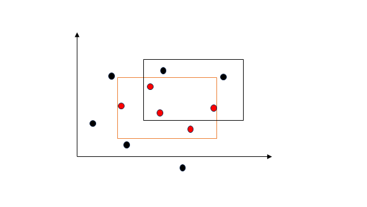

The PAC Learning Framework
===============================

在设计和分析针对样本的学习算法时，需要考虑一下几个基本的问题：
- What can be learned efficiently?
- What is inherently hard to learn?、
- How many examples are needed to learn successfully?
- Is there a general model of learning?

为解决这些问题，我们可以通过**概率近似正确（Probably Approximately Correct）** 学习框架对上述问题形式化并给出答案。PAC框架借助样本复杂度和学习算法的时间空间复杂度来定义可学习的概念类。

框架内容
-------------------------
**概念类**：我们可能想要学习的概念构成的集合，记为$\mathcal{C}$

我们假定所有的经验（样本）是独立同分布的，并且服从的某个固定但未知的分布$\mathcal{D}$。在这样的假定下，机器学习问题可以如下形式化：

学习器的任务是：利用带标签的样本集$S$，从所有可能的概念集合$\mathcal{H}$（假设集）中选择一个假设$h_S\in\mathcal{H}$，使其关于待学习的目标概念$c\in\mathcal{C}$有尽可能小的**泛化误差**

**泛化误差**：*给定一个假设$h\in\mathcal{H}$，一个目标概念$c\in\mathcal{C}$，以及一个潜在分布$\mathcal{D}$，则$h$的泛化误差或风险定义为*

$$R(h)=\underset{x\sim\mathcal{D}}{\mathbb{P}}[h(x)\ne c(x)]=\underset{x\sim\mathcal{D}}{\mathbb{E}}[\mathbf{1}_{h(x)\ne c(x)}]$$

然而我们根据定义可以知道，对于学习器而言，一个假设的泛化误差并不是直接可得到的，由于分布$\mathcal{D}$和目标概念$c$均是未知的。我们可以在有标签的样本集$S$上度量一个假设的**经验误差**

**经验误差**：*给定一个假设$h\in\mathcal{H}$，一个目标概念$c\in\mathcal{C}$，以及一个样本集$S=(x_1,x_2,...x_m)$，则$h$的经验误差定义为*

$$\hat{R}_S(h)=\frac{1}{m}\sum_{i=1}^m\mathbf{1}_{h(x_i)\ne c(x_i)}$$

因此总结一下，$h\in\mathcal{H}$的经验误差是在样本集$S$上的平均误差，而$h\in\mathcal{H}$的泛化误差则是在分布$\mathcal{D}$上的期望误差。不加证明的结论是，在某些一般性的假设下，这两个误差关于近似程度的保证有较高的概率成立。

注意到这样一个事实（只要你学过概率论）:对于一个固定的$h\in\mathcal{H}$，在独立同分布样本集上经验误差的期望等于泛化误差。换句话说，经验误差是泛化误差的无偏估计量。

$$\underset{S\sim\mathcal{D}^m}{\mathbb{E}}[\hat{R}_S(h)]=R(h)$$

**************************************

**PAC学习**：*如果存在一个算法$\mathcal{A}$以及一个多项式函数$poly()$，使得对于任意$\epsilon>0$以及$\delta>0$，如果所有在$X$上的分布$D$以及任意目标概念$c\in C$，对于满足$m\geq poly\left(\dfrac{1}{\epsilon},\dfrac{1}{\delta},n,size(c)\right)$的任意样本规模$m$均有下式成立，那么概念类$C$是PAC可学习的*

$$\underset{S\sim\mathcal{D}^m}{\mathbb{P}}[R(h_S)\leq\epsilon]\geq1-\delta$$

*进一步地，若算法$\mathcal{A}$的运行复杂度在$poly\left(\dfrac{1}{\epsilon},\dfrac{1}{\delta},n,size(c)\right)$内，则概念类$C$是高效PAC可学习的*

PAC之所以称为概率近似正确，可以作如下理解：如果输入到一个算法的样本点的书目对于$1/\epsilon$和$1/\delta$是多项式的，并且由该算法基于这些样本点得到的假设是以高概率（至少$1-\delta$）近似正确（误差至多为$\epsilon$）的，则概念类$\mathcal{C}$是PAC可学习的。

关于PAC，有两点需要澄清与强调：
- PAC学习框架是**不依赖分布的模型**，指的是对产生样本的分布$\mathcal{D}$没有特别的假设
- PAC学习框架考虑的是概念类$\mathcal{C}$的可学习性，而不是一个特殊概念的可学习性。对于学习算法，概念类$\mathcal{C}$是已知的，而需要学习的目标概念$c\in\mathcal{C}$是未知的。

### 一个例子：超矩形的PAC学习

证明：一个在$\mathbb{R}^n$中平行与坐标轴的超矩形可表示为$[a_1,b_1]\times...\times[a_n,b_n]$。平行于坐标轴的超矩形是PAC可学习的。（这就是决策树模型）

从简单的$n=2$的平面来理解上面这个问题，下图是一个示意。在二维情况下，样本集是平面上的所有点，概念类$\mathcal{C}$为$\mathbb{R}^2$上的所有平行于坐标轴的矩形。本例的学习问题是依据有标签的训练样本确定一个误差较小的平行与坐标轴的目标矩形。

<!--注意在rectangle.png和“图片title”之间的那个空格，没有会无法显示图片-->
上图中的红框表示平行于坐标轴的目标矩形（axis-aligned rectangles），而黑框是一个假设。请注意是先有红色矩形的概念，再通过实际的样本点来获得假设。（想象有一个红色的得分区域而你不知道，只能通过抽取的样本点是否得分，来给出你对这个得分区域的假设）

很显然在黑框假设下，存在黑色的非目标点，也并未包含所有的红色目标点。

为了说明这样一个二维平面上的概念类是PAC可学习的，我们首先设计一个简单的算法$\mathcal{A}：$对于带标签的样本集$S$，根据所有红点返回一个最保守的矩形（下图中的$R^{'}=R_S$）（这个算法也很直观，根据过去的得分点来给出最保守的得分区域估计）

现在固定某个准确性水平$\epsilon>0$，令$\underset{x\sim\mathcal{D}}{\mathbb{P}}[R]>\epsilon$，$\underset{x\sim\mathcal{D}}{\mathbb{P}}[R]$给出了样本在分布$\mathcal{D}$下落入$R$假设区域的概率。
否则如果是定义$\underset{x\sim\mathcal{D}}{\mathbb{P}}[R]\leq\epsilon$
,那么由于误差只会出现在属于$R$但不属于$R_S$的区域$R-R_S$中，无论具体的样本集$S$情况如何，总会有误差控制

$$risk(R_S)=\underset{x\sim\mathcal{D}}{\mathbb{P}}[R-R_S]<\underset{x\sim\mathcal{D}}{\mathbb{P}}[R_S]\leq\epsilon$$

成立。换句话说，这种情况下无论样本规模$m$多少，总会有$\underset{S\sim\mathcal{D}^m}{\mathbb{P}}[risk(R_S)\leq\epsilon]=1$。

回到$\underset{x\sim\mathcal{D}}{\mathbb{P}}[R]>\epsilon$的情况，假定目标概念$R=[a_1,b_1]\times[a_2,b_2]$。定义$r_1,r_2,r_3,r_4$分别是矩形边界和蓝线围成的矩形，保证 $\underset{x\sim\mathcal{D}}{\mathbb{P}}[r_i]=\dfrac{\epsilon}{4},i=1,2,3,4$
（这是可以做到的，比如对于$r_1=[a_1,b_1]\times[s_1,b_2]$，定义$s_1=inf\{s:\mathbb{P}[[a_1,b_1]\times[s,b_2]]\geq\epsilon/4\}$）。

请注意这四个区域可能会与假设区域$R_S$重叠，而上图为了显示方便没有表现出这一点。

如果认为$R_S$会与所有的$r_i,i=1,2,3,4$都有重叠，观察到事实

$$R-R_S\in\bigcup_{i=1}^4{r_i}，when\ R_S\cap r_i\ne\emptyset,i=1,2,3,4$$

这意味着$risk(R_S)=\underset{x\sim\mathcal{D}}{\mathbb{P}}[R-R_S]\leq\sum_{i=1}^4\underset{x\sim\mathcal{D}}{\mathbb{P}}[r_i]=\epsilon$，这种情况与样本规模无关。

因此当$R_S$至少与$r_i$中的一个区域无重叠时，$risk(R_S)>\epsilon$才可能发生。因此我们得到如下推导：

$$\underset{S\sim\mathcal{D}^m}{\mathbb{P}}[risk(R_S)>\epsilon]\leq\underset{S\sim\mathcal{D}^m}{\mathbb{P}}\left[\bigcup_{i=1}^{4}\{R_S\cap r_i=\emptyset\}\right]\leq\sum_{i=1}^4\underset{S\sim\mathcal{D}^m}{\mathbb{P}}[R_S\cap r_i=\empty]=4(1-\epsilon/4)^m\leq 4e^{(-m\epsilon/4)}$$

（最后一步借由不等式$1-x\leq e^{-x}，x\in\mathbb{R}$）

那么为了对任意的$\delta>0$，有$\underset{S\sim\mathcal{D}^m}{\mathbb{P}}[risk(R_S)>\epsilon]\leq\delta$成立，我们使
$$4e^{-m\epsilon/4}\leq\delta\Leftrightarrow m\geq\frac{4}{\epsilon}log\frac{4}{\delta}$$

这说明，对于我们给出的算法$\mathcal{A}$，对于任意$\epsilon>0,\delta>0$，如果样本规模$m\geq\frac{4}{\epsilon}log\frac{4}{\delta}$，则会有$\underset{S\sim\mathcal{D}^m}{\mathbb{P}}[risk(R_S)>\epsilon]\leq\delta$成立。因此平行于坐标轴的矩形概念类是PAC可学习的。（将上面的算法推广至$n$维即可）

**************************************
例子补充说明：
- PAC学习算法的样本复杂度为$O\left(\dfrac{4}{\epsilon}log\dfrac{4}{\delta}\right)$
- 本例还存在其他的PAC学习算法，比如返回不包括负样本点的最大矩形
- 本例中考虑的假设$\mathcal{H}$和概念类$\mathcal{C}$是**一致**的，并且假设集的势是无限的
- 这种证明思路严格依赖于本例的特殊几何构造，因此并不是可推广的方法
- 表示样本复杂度的的等价方式是**泛化界**，其指的是以至少$1-\delta$的概率，可得到依赖样本规模$m$和$\delta$的某个量作为$risk(R_S)$的上界。上式中可以反解得到学习算法的如下泛化界

$$risk(R_S)\leq\epsilon=\frac{4}{m}log\frac{4}{\delta}$$

对有限假设集的可学习保证（一致情况）
-----------------------------
在上面的平行于坐标轴的矩形例子中，学习算法返回的假设$h_S$总是一致的（猜概念类很准），这样的假设在训练集$S$上不会产生误差（只会有没包括的正样本，而没有包括的负样本）

我们将在假设集的势$\mathcal{|H|}$有限的情况下，对一致的假设给出具有一般性的样本复杂度界（即**泛化界**）。在这里由于讨论一致的情况，我们有假定目标概念$c\in\mathcal{H}$

**学习界——有限假设集，一致情况**：*令假设集$\mathcal{H}$是一个有限的、由所有的$f:\mathcal{X}\rightarrow\mathcal{Y}$组成的集合（其中$\mathcal{X}$表示样本,$\mathcal{Y}$表示标签）。令$\mathcal{A}$为学习任意目标概念$c\in\mathcal{H}$的算法，并且独立同分布样本$S$返回的是一个一致的假设:$h_S:\hat{R}_S(h_S)=0$。那么，对于任意的$\epsilon,\delta>0$，不等式$\underset{S\sim\mathcal{D}^m}{\mathbb{P}}[R(h_S)\leq\epsilon]\geq 1-\delta$成立的条件是：*

$$m\geq\frac{1}{\epsilon}\left(log\mathcal{|H|}+log\frac{1}{\delta}\right)$$

*对应的，由这样的样本复杂度等价地可以得到如下的泛化界：对于任意$\epsilon,\delta>0$，以至少为$1-\delta$的概率，有*

$$R(h_S)\leq\frac{1}{m}\left(log\mathcal{|H|+log\frac{1}{\delta}}\right)$$

*******************************
$proof$: 固定$\epsilon>0$，此时对于算法$\mathcal{A}$选择了哪个假设$h_S\in\mathcal{H}$是无从得知的（选择的假设既与算法$\mathcal{A}$有关，又与样本$S$有关）。此时我们需要给出对所有一致的假设$h_S$都成立的界——**一致收敛界**。

定义$\mathcal{H}_\epsilon=\{h\in\mathcal{H}:R(h)>0\}$，这是由一些一致但误差大于$\epsilon$的假设$h\in\mathcal{H}$组成的集合。如果假设$h$在$\mathcal{H}_{\epsilon}$中的概率与独立同分布的样本$S$是一致的，则可以得到在样本$S$中任意样本点都不存咋误差的概率上界满足：

$$\mathbb{P}[\hat{R}_S(h)=0]\leq(1-\epsilon)^m$$

进而根据联合界，有下式成立：

$$\mathbb{P}\left[\exist h\in\mathcal{H}_{\epsilon}:\hat{R}_S(h)=0\right]=\mathbb{P}\left[\hat{R}_S(h_1)=0\vee...\vee\hat{R}_S(h_{\mathcal{|H_{\epsilon}|}})=0\right]$$

$$\leq\sum_{h\in\mathcal{H}_{\epsilon}}\mathbb{P}[\hat{R}_S(h)=0]\leq|\mathcal{H}|(1-\epsilon)^m\leq|\mathcal{H}|e^{-m\epsilon}$$

令上式右边等于$\delta$求解$\epsilon$，则定理得证。

************************************

上面的定理表明了以下几点：
- 当假设集$\mathcal{H}$的势是有限时，任意的学习算法$\mathcal{A}$是PAC可学习的。
- 一致的假设的泛化误差以一个岁样本规模$m$增加而减少的项为上界。这种情况意味着学习算法将在更大规模的带标签训练样本上获得更大收益。
- 该定理给出的泛化误差减少速率为$O(\dfrac{1}{m})$

### 一个例子：普遍概念类不是PAC可学习的

我们考虑由$n$个布尔值构成的集合$\mathcal{X}=\{0,1\}^n$，$\mathcal{X}$中的一个点由$n$个数（0或1）来表示。令$\mathcal{U}_n$是由$\mathcal{X}$所有子集构成的概念类。则$\mathcal{U}_n$是否是PAC可学习的概念类？

由于假设的一致性，假设类必须包含概念类。由$\mathcal{H}\in\mathcal{U}_n\Rightarrow|\mathcal{H}|\geq|\mathcal{U}_n|=2^{2^n}$，根据定理，需要满足如下的样本复杂度界：

$$m\geq\frac{1}{\epsilon}\left((log2)\times2^n+log\frac{1}{\delta}\right)$$

这样的界表明，需要的训练样本数量与$n$呈指数关系。因此，无法通过该定理得到概念类是PAC可学习的保证（不是多项式计算代价）

这个例子的意义在于，很多时候我们可以将原始变量通过引入布尔值来判断PAC可学习问题。虽然训练样本的分布发生了变化，但由于PAC框架与分布无关。PAC可学习性的等价性得到保证。

对有限假设集的可学习保证（不一致情况）
-----------------------------

对于大多数更实际的一般情况，可能在$\mathcal{H}$中不存在与带标签的样本一致的假设，因为待学习的问题本身较难或者概念类比学习算法采用的假设集更复杂。

然而，不一致不意味着无法学习，在训练样本集上产生少量误差的不一致假设可能是有用的，并且这样的假设在一定条件下是存在学习效果的保证的。

为了在这种更一般的情况喜爱给出学习保证，我们将利用**Hoeffding不等式**或者下面的推论（关于泛化误差与单一假设的经验误差）：

**引理**：*固定$\epsilon>0$，令$S$表示数目为$m$的独立同分布样本集，则对于任意假设$h:\mathcal{X}\rightarrow\{0,1\}$（标签是二值的），有如下不等式成立：*

$$\underset{S\sim\mathcal{D}^m}{\mathbb{P}}[\hat{R}_S(h)-R(h)\geq\epsilon]\leq e^{-2m\epsilon^2}$$

$$\underset{S\sim\mathcal{D}^m}{\mathbb{P}}[\hat{R}_S(h)-R(h)\leq-\epsilon]\leq e^{-2m\epsilon^2}$$

*根据联合界，结合上面两个不等式得到双边不等式：*

$$\underset{S\sim\mathcal{D}^m}{\mathbb{P}}\left[\left|\hat{R}_S(h)-R(h)\right|\geq\epsilon\right]\leq 2e^{-2m\epsilon^2}$$

***************************
$proof$:可以直接由**Hoeffding不等式**得到
**************************

令上式右边等于$\delta$并反解$\epsilon$可以得到如下的单一假设误差界

**推论，单一假设泛化界**:*固定一个假设$h:\mathcal{X}\rightarrow\{0,1\}$，则对于任意$\delta>0$，以至少$1-\delta$的概率，有如下不等式成立：*

$$R(h)\leq\hat{R}_S(h)+\sqrt{\dfrac{log\dfrac{2}{\delta}}{2m}}$$

### 一个例子：抛硬币中的经验误差与泛化误差的差距
假设有一个偏置的硬币，其正面朝上的概率为$p$，我们的假设总是猜测硬币的结果为反面。那么在这样的设定下，真实误差率为$R(h)=p$，通过独立同分布的训练样本可以得到经验概率$\hat{p}$，进而得到经验误差$\hat{R}_S(h)=\hat{P}$。那么根据上述推论，以至少$1-\delta$的概率，我们有如下保证：

$$|p-\hat{p}|\leq\sqrt{\frac{log\dfrac{2}{\delta}}{2m}}$$

如果设定$\delta=0.02$并采用500个训练样本，则至少以$98\%$的概率，对于经验概率$\hat{p}$的精度有如下的保证：

$$|p-\hat{p}|\leq\sqrt{\frac{log\dfrac{2}{0.02}}{2\times500}}\approx0.48$$

*************************************************

附记
-------------------------------
PAC学习框架首先由Valiant[1984]提出。