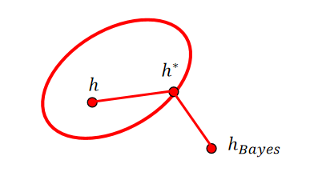

模型选择
===================================
学习算法设计中一个关键问题是假设集合$\mathcal{H}$的选择，这被称为模型选择问题。

当一个样本的标签可以有某个唯一的可测函数$f:\mathcal{X}\rightarrow\mathcal{Y}$（以概率1成立时），这种情况被称作**确定性情境**。此时，考虑一个输入空间服从的分布$\mathcal{D}$，依分布$\mathcal{D}$采样得到的训练样本$(x_1,x_2,...,x_n)$，并且通过$f:y_i=f(x_i)，i\in[1,n]$确定对应的标签。很多学习问题都可以在此确定性情形下完成形式化。根据定义可知，存在一个没有泛化误差的目标函数使得$R(h)=0$

我们推广到更加常见的**随机性情境**。此时机器学习要解决的问题是，找到一个有较小泛化误差的假设$h\in\mathcal{H}$

$$R(h)=\underset{(x,y)\sim\mathcal{D}}{\mathbb{P}}[h(x)\neq y]$$

此时学习算法输出的标签是输入的一个概率函数。例如想用一个人的身高和体重推断这个人的性别，标签往往不是唯一的，对于大多数输入，男生和女生都是可能的性别。对于每个固定的输入(年龄，身高，体重...)，其输出的标签为男性对应的是一个概率分布。

**贝叶斯误差:** *给定一个在$\mathcal{X\times Y}$上的分布$\mathcal{D}$，响应的贝叶斯误差$R^*$定义为由可测函数类$h:\mathcal{X\rightarrow Y}$产生的误差下界：*

$$R^*=\underset{h(可测)}{inf} R(h)$$

*一个满足$R(h)=R^*$的假设$h$被称为贝叶斯假设或贝叶斯分类器。*

根据上述定义，对于确定性情境$R^*=0$，对于随机性情境$R^*\neq 0$

------------------------------------
如何选择假设集$\mathcal{H}$?一个足够丰富或复杂的假设集可以包含理想的贝叶斯分类器。但是这样的族是充满困难的。更一般的说，假设集$\mathcal{H}$的选择需要权衡利弊，可以通过**估计**和**近似误差**进行分析。

我们的讨论将集中的二元分类的特殊情况喜爱，但可以直接扩展到不同的任务和损失函数。

估计误差和近似误差
-------------------------------
令$\mathcal{H}$是一个可以将$\mathcal{X}$映射到$\{0,1\}$的函数族。从$\mathcal{H}$中选取的假设的误差，即误差$R(h)$和贝叶斯误差$R^*$的差，可以按照下式进行分解：

$$R(h)-R^*=\underset{估计误差}{\left[R(h)-\underset{h\in\mathcal{H}}{infR(h)}\right]}+\underset{近似误差}{\left[\underset{h\in\mathcal{H}}{infR(h)}-R^*\right]}$$

估计误差依赖于所选定的假设$h$。他相对于由$\mathcal{H}$中的假设获得的误差下确界来测量$h$的误差，或达到下确界时磊中的最优家色号$h^*$的误差。**注意！之前的不可知PAC学习的定义便是基于估计误差的。**

近似误差衡量了用$\mathcal{H}$对贝叶斯误差的近似程度。这种误差可以看做假设集$\mathcal{H}$的一个性质，衡量假设集的丰富程度。对于更复杂或更丰富的假设$\mathcal{H}$，近似误差的减少往往以较大的估计误差作为代价。

$h^*$表示一个类中的最佳假设即$R(h^*)=\underset{h\in\mathcal{H}}{infR(h)}$，由于$R^*$的潜在分布$\mathcal{D}$是未知的，即使有各种噪声假设，估计近似误差也是非常困难的。相比之下，**算法$\mathcal{A}$D的估计误差**，即在样本$S$上训练后返回的假设$h_s$的估计误差，有时可以用泛化界进行结点

经验风险最小化
-------------------------------
**经验风险最小化**(Empirical Risk Minimization)是估计误差有界的标准算法。ERM寻求最小化训练样本上的误差：

$$h_s^{ERM}=\underset{h\in\mathcal{H}}{argmin}\hat{R}_s(h)$$

**命题**:*对于任意样本$S$，对于ERM返回的假设，有以下不等式成立：*

$$\mathbb{P}\big[R(h_s^{ERM})-\underset{h\in\mathcal{H}}{inf}R(h)>\epsilon\big]\leq\mathbb{P}\big[\underset{h\in\mathcal{H}}{sup}|R(h)-\hat{R}_s(h)|>\frac{\epsilon}{2}\big]$$

*******************************
$proof:$由定义得到的$\exists\epsilon>0,R(h_{\epsilon})\leq\underset{h\in\mathcal{H}}{inf}R(h)+\epsilon$和$\hat{R}_s(h_s^{ERM})\leq\hat{R}_s(h_{\epsilon})$即可简单推导得到

*******************************

结合第二章的Rademacher复杂度、生长函数或$\mathcal{H}$的VC-维的知识。当$\mathcal{H}$有一个有利的Rademacher复杂度时，例如有限的VC-维，对于一个足够大的样本，有很高的概率可以保证估计误差很小。然而ERM的性能通常很差。这是因为该算法**忽略了假设集的复杂性**：在实际中，要么$\mathcal{H}$不够复杂，这种情况下近似误差可能非常大，要么$\mathcal{H}$非常丰富，这种情况下估计误差的界会非常松散。

此外在许多情况下，确定ERM的解难以计算。例如，在训练样本上找到有着最小误差的线性假设是NP-难的（是输入空间维数的函数）

交叉验证
----------------------------------------------
本来有一种称为**结构风险最小化**的方法SRM，不过这种模型依赖于理论学习边界，为每个假设集指定一个惩罚。**交叉验证**是一种在实践中最常用的模型选择方法。

设$(\mathcal{H}_k)_{k\geq 1}$是一个可数的假设集序列，且其复杂度不断增加，交叉验证的解如下所示。设$S$为独立同分布并被标记的样本，大小为$m$，$S$分为大小为$(1-\alpha)m$的样本$S_1$和大小为$\alpha m$的样本$S_2$，其中$\alpha\in(0,1)$通常选择相对较小的值。$S_1$用于训练，$S_2$用于验证。对于任意$k\in\mathbb{N}$，令$h_{S_1,k}^{ERM}$表示ERM使用假设集$\mathcal{H}_k$在$S_1$上运行得到的解，交叉验证返回的假设$h_s^{CV}$为$S_2$上性能最好的ERM解$h_{S_1,k}^{ERM}$：

$$h_S^{CV}=\underset{h\in\{h_{S_1,k}^{ERM}:k\geq 1\}}{argmin}\hat{R}_{S_2}(h)$$

下面的泛化结果将帮助我们获得交叉验证的学习保证

**命题**:*对于任意$\alpha>0$，任意样本数$m\geq 1$，有以下不等式成立*：

$$\mathbb{P}\Big[\underset{k\geq 1}{sup}|R(h_{S_1,k})^{ERM}-\hat{R}_{S_2}(h_{S_1,k})^{ERM}|>\epsilon+\sqrt{\frac{\log k}{\alpha m}}\Big]\leq 4e^{-2\alpha m\epsilon^2}$$

******************************
$proof:$涉及Hoeffding不等式
******************************

n-折交叉验证
------------------------------------
在实践中，可用的标记数据量通常太少，无法留出一个验证样本，因为剩余的数据量将不足以用来训练。一个经典的**5-折交叉验证**如下：

| | $m_1$ | $m_2$ | $m_3$ | $m_4$ | $m_5$ |
| - | - | - | - | - | - |
| 第一次| 训练 | 训练 | 训练 | 训练 | **测试**|
| 第二次| 训练 | 训练 | 训练 | **测试** | 训练|
| 第三次| 训练 | 训练 | **测试** | 训练 | 训练|
| 第四次| 训练 | **测试** | 训练 | 训练 | 训练|
| 第五次| **测试** | 训练 | 训练 | 训练 | 训练|

这种交叉验证的学习算法在除了第$i$折之外的所有数据上进行训练，并生成假设$h_i$，$h_i$的性能在第$i$折上进行测试。基于$h_i$的平均误差，被称之为**交叉验证误差**

$$\hat{R}_{CV}=\frac{1}{n}\sum_{i=1}^n\underset{h_i在第i折上的误差}{\underbrace{\frac{1}{m}\sum_{j=1}^{m_j}L\Big(h_i(x_{ij}),y_{ij}\Big)}}$$

基于正则化的算法
-----------------------
受SRM方法启发的另一大类算法是**基于正则化的算法**，基本形式是下述的无约束优化问题：

$$\underset{h\in\mathcal{H}}{argmin}\hat{R}_S(h)+\lambda\mathcal{R}(h)$$

对于某些$\lambda>0$，$\mathcal{R}(h)$叫正则化项，并且$\lambda>0$被视为一个超参数，因为他的最优值通常是未知的。对于大多数算法，当$\mathcal{H}$是希尔伯特空间的子集是，正则化项$\mathcal{R}(h)$通常选为一个$||h||$的递增函数，$||.||$表示某个范数。变量$\lambda$通常被称为**正则化参数**。$\lambda$的值越大，惩罚就越大。而当$\lambda$接近或等于0，即正则化项没有作用时，算法与ERM一致。在实践中通常通过CV交叉验证或使用n-CV来选择。

可以参考广义LASSO问题来理解

附记
-------------------------------
结构化风险最小化理论源于Vapnik，他最初使用的惩罚项是基于假设集的VC-维。Cortes、Mohri和Syed与其他相关文献提出了一种**投票风险最小化**的模型选择理论。近年来许多集成方法以此理论得到了卓越的效果。