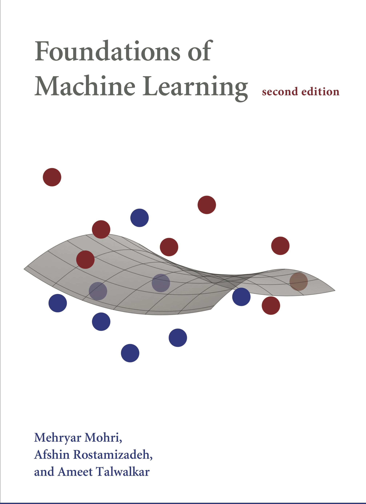

.. vim: syntax=rst

.. highlight:: sh

机器学习理论
=====================
参考书目为Mehryar Mohri的《Foundations of Machine Learning》

什么是机器学习？
---------------------------
机器学习广义上可以被定义为基于经验提升性能或者进行精准预测的计算方法。
**经验**指的是学习器可以利用的过去的信息（也被称为样本）
机器学习旨在设计高效和准确的预测算法，因此与计算机科学（Computer Science）领域类似，
衡量方法好坏质量的重要指标是时间和空间复杂度。
由于机器学习算法的成功取决于所采用的数据，因此机器学习本质上与数据分析和统计相关。
更一般地，机器学习技术是一类将计算机科学中的基本概念与统计、概率和优化方面思想相结合的数据驱动方法

机器学习的任务有哪些？
-----------------------------
- 分类（classification）：例如文档分类，诸如政治、商业、经济或运动等多类别，图像分类，如肖像、动物或风景等。
某些困难的场景下，需要分类的类别可能达到几百上千，甚至于无限，例如OCR，文本分类或者语音识别。
- 回归（regression）：
- 排序（ranking）：经典的例子是网页搜索排序，这是所有的搜索引擎公司的重中之重
- 聚类（clustering）：分析大数据集合中的同质子集。例如大规模人群分类，社交网络分块
- 降维（dimensionality）或流形学习（manifold learning）：如何将高维的原始表示转为低维表示
同时保持原始表示的若干性质。常见例子是计算机视觉中的图像任务

.. toctree::
   :maxdepth: 1
   :titlesonly:

   ML1_PCA.md

   